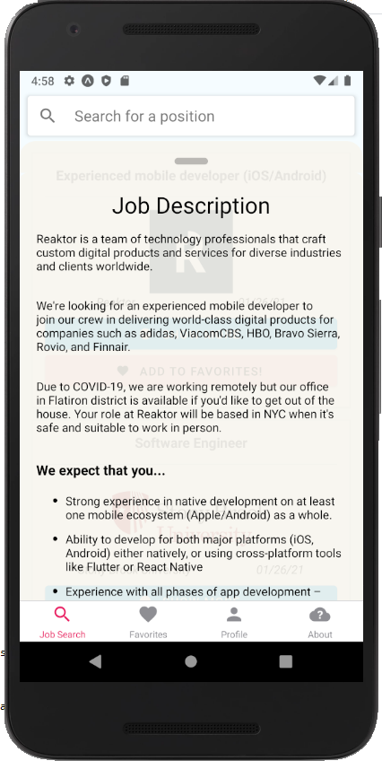

# Final React Native Project - [nirc7/Comp2020-2021](https://github.com/nirc7/Comp2020-2021)

Job seeking application written in React Native (Expo) with a .NET + MSSQL backend.

Natanel Endelshtein  
Alex Kalenyuk

**Note**:  
Server-side code is located under [`backend-code`](backend-code), and queries are at [`native_final_queries.sql`](native_final_queries.sql).

## Plugins

### Major

- Location
- ImagePicker
- BottomSheet Modal (Swipeable modal, 'reanimated-bottom-sheet')
- JSSoup (extract attributes from html string - for example, get href which we needed for applying in external site)
- WebView (react-native-render-html)
- Firebase
- Splash Screen

### Minor

- AsyncStorage
- Constants
- Linking
- Permissions

